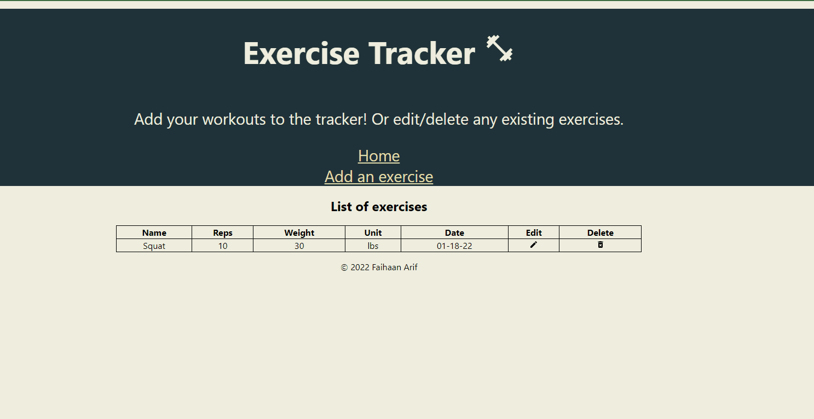

# Exercise Tracker

## Description

Full Stack web app to allow users to log workout information. Users can create exercises, view saved exercises, update, and delete exercises. REST API was created in backend
to communicate with database. 

## Demo

## Tech

MERN Stack (MongoDB, Express, React, Node.js)

